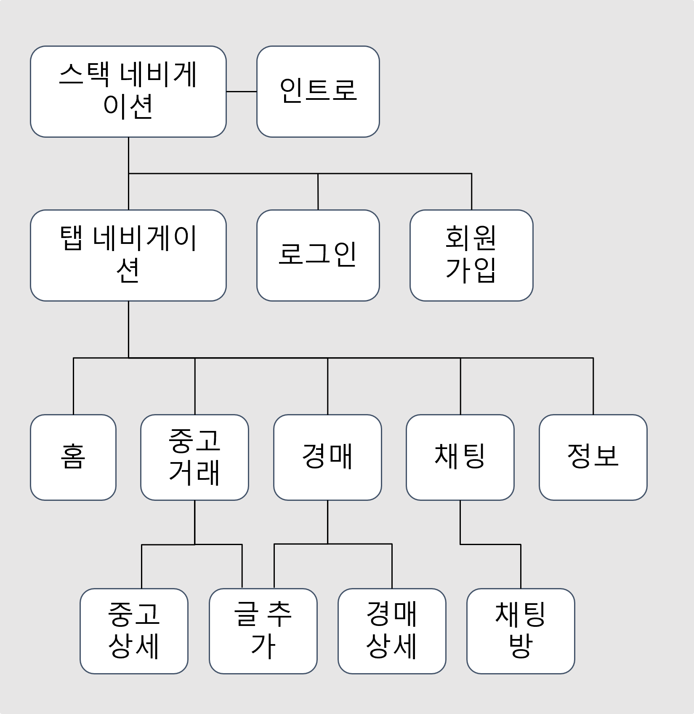
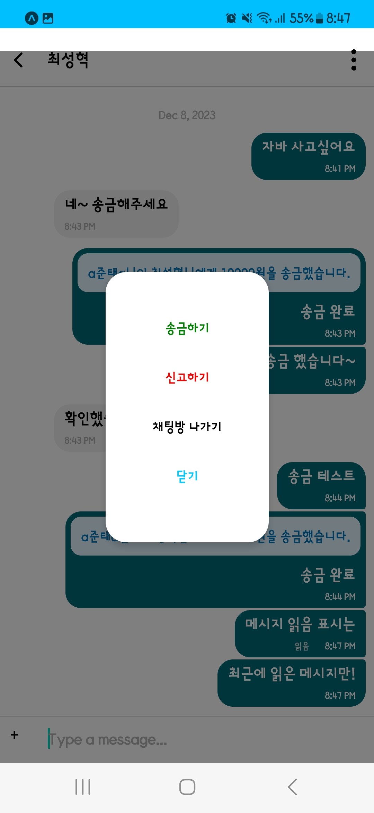
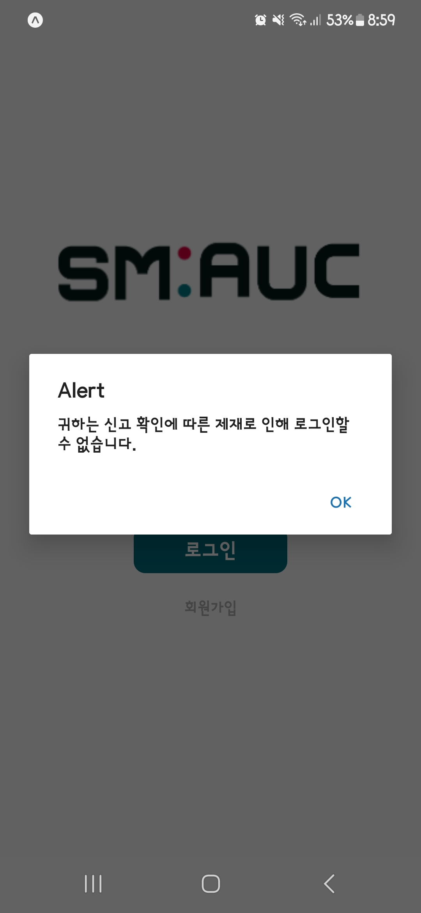
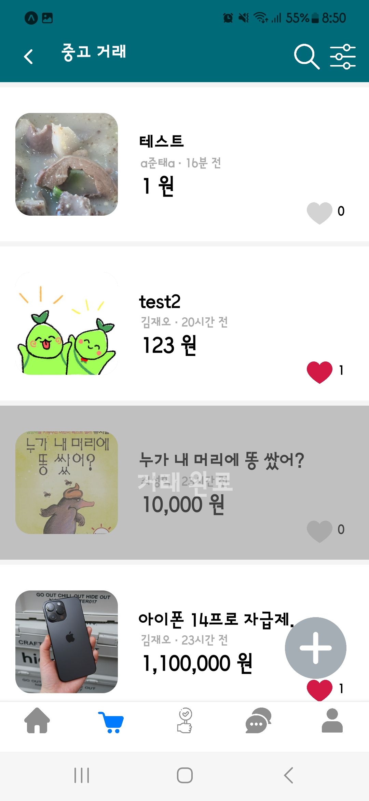
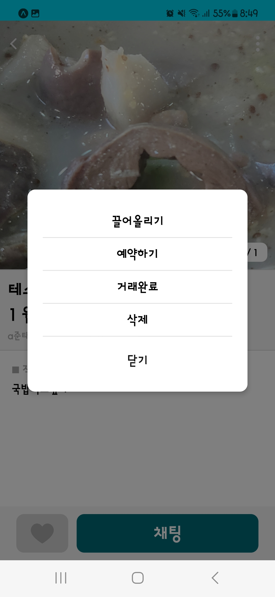
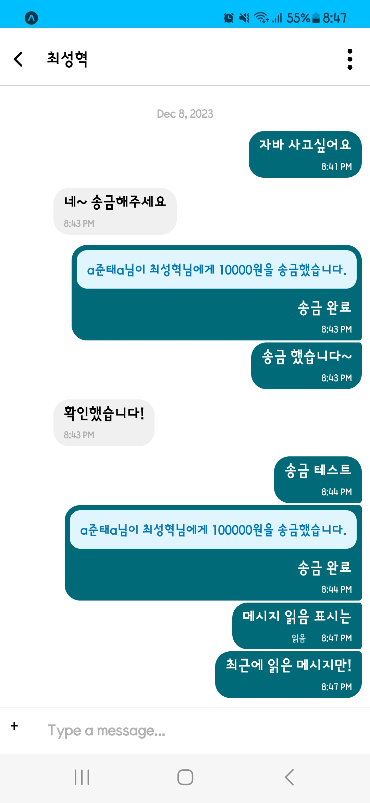
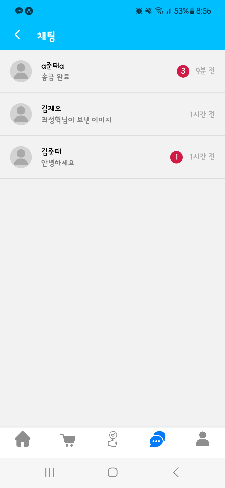

# 중고거래 모바일 어플리케이션 (2023.12.)

프로젝트 명: 선문옥션

개발 인원: 3명

기술 스택: React Native, Firebase

Expo Go 환경에서 개발함.

## 구성도

## 주요 기능

### 유저 관리
- 회원가입 / 로그인
- **신고** 시스템
- 유저 **밴** 시스템 (로그인 불가)

### 커뮤니티
- 거래 게시글 작성
- **이미지** 업로드 가능
- **가격**, **카테고리** 설정 가능
- **좋아요**(찜) 시스템 제공
- 끌어올리기, 예약, 거래완료와 같이 **거래글 상태** 관리 가능
- **검색**을 통한 게시글 필터링
- **카테고리 선택**을 통한 게시글 필터링

### 채팅 기능
- 거래 희망 시, 작성자와 **채팅** 시작 가능
- 애플리케이션 내 재화를 통해 **금액 지불** 가능
- 메시지 **읽음** 표시

## 시연 영상 
- 하단의 영상이 안 보인다면 [여기로](./image/)

https://github.com/user-attachments/assets/9c36a9ae-9707-4a50-899e-c7907ebfddbb

https://github.com/user-attachments/assets/518bd5d4-fa30-45b0-bfab-45ee1cbf44d6

https://github.com/user-attachments/assets/0f4f8353-a83d-4645-844c-5b9c687c5eea

